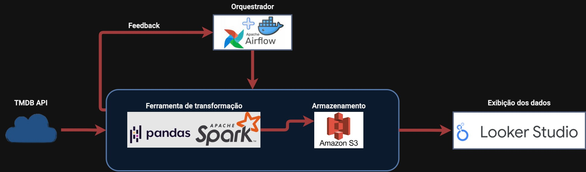

# Pipeline de dados (ETL) do TMDB
ETL de dados do TMDB (API gratuita) de informações sobre filmes e séries, armazenamento no AWS S3 e exibição no Looker Studio.

## Instalação e dependencias
- Python 3.11
- JDK 22 (Necessário variaveis de ambiente JAVA_HOME, SPARK_HOME, etc...)
- Poetry foi utilizado para gerenciamento de pacotes do projeto porém também gerei um requirements.txt para o Pip
- Se caso queira usar Poetry: poetry install no diretório contendo poetry.lock e pyproject.toml
- Se caso queira usar Pip: pip install -r requirements.txt no diretório contendo requirements.txt
- ### Spark e pyspark
- https://spark.apache.org/docs/latest/
- https://spark.apache.org/docs/latest/api/python/index.html
- ### Airflow
- No terminal do projeto execute os seguintes comandos:
```cd project```
```docker-compose up airflow-init```
```docker-compose up -d```
após a execução dos comandos o Airflow estará rodando no localhost:8080

##Arquitetura da aplicação

